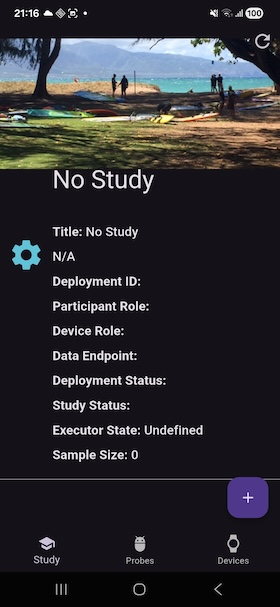
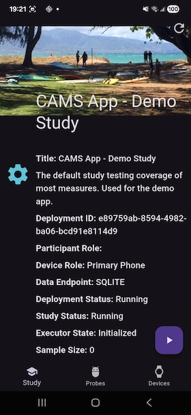
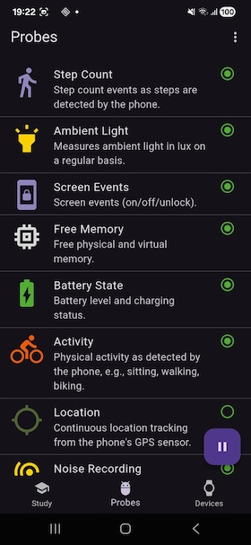
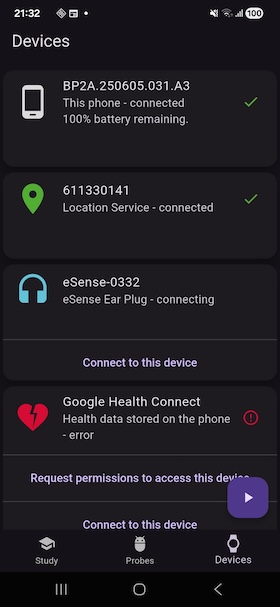
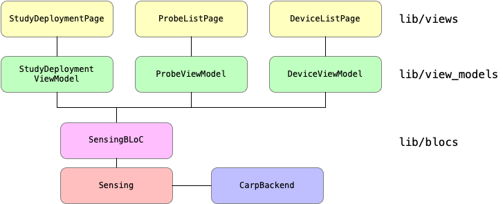

# CARP Mobile Sensing App

The CARP Mobile Sensing App provides an example on how to use the [`carp_mobile_sensing`](https://pub.dartlang.org/packages/carp_mobile_sensing) package.
The app uses up a `SmartphoneStudyProtocol` (or just "Protocol") that specify a set of `Device`s and collects a set of `Measures`s. Following the [CARP Mobile Sensing architecture](https://github.com/cph-cachet/carp.sensing-flutter/wiki/1.-Software-Architecture), the protocol is "Deployed" on the phone and data collection is done via a set of "Probes" which each use a "Device", including the phone itself.

The UI of the app is shown below, showing (from left to right) a Study page with no study, a Study page with a running study, the Probe List page, and the Device List page.

_
_
_


The app basically illustrates how you can add a study (using the `+` button), and start, resume, and pause the study (using the `play` and `pause` button).
The Study page shows basic information about the running study, the Probe list page shows the running probes (which reflects each `measure` specified in the protocol), and the Device list page shows the devices used in this deployment. For each device, you can request the permissions to use this device, and then connect to it.

The app can run in two main "deployment modes":

* `local` - adds a local study protocol and deployment, and store data locally on the phone.
* `production`, `test`, and `dev` - uses the CAWS production/test/dev server to get the study deployment and store data.

If running in local deployment mode, the protocol is generated on the phone using a `LocalStudyProtocolManager`, whereas when running in production/test/dev mode, the deployment is fetched from a CAWS server.

The architecture of the app is illustrated below. It follows the [Model-ViewModel-View](https://en.wikipedia.org/wiki/Model%E2%80%93view%E2%80%93viewmodel), which is the recommended [Flutter Architecture](https://docs.flutter.dev/app-architecture).



All sensing logic is handled via the `Sensing` class responsible for handling sensing via the [`carp_mobile_sensing`](https://pub.dartlang.org/packages/carp_mobile_sensing) package.
All business logic is handled by the singleton `SensingBLoC` which is the only way the UI models can access and modify data or initiate life cycle events (like pausing and resuming sensing).
All data to be shown in the UI are handled by view models, and finally each page is implemented as a [`StatefulWidget`](https://docs.flutter.io/flutter/widgets/StatefulWidget-class.html) in Flutter.
Each view widget only knows its corresponding view model and the view model knows the BloC.
**NO** data or control flows between the UI and the Bloc or Sensing layer.

## Sensing BLoC

Since the [`SensingBLoC`](https://github.com/cph-cachet/carp.sensing-flutter/blob/main/apps/carp_mobile_sensing_app/lib/src/blocs/sensing_bloc.dart) is the controller of the entire app, let's look closer on this class. Below are essential parts shown (omitting some implementation details):

````dart
/// This is the main Business Logic Component (BLoC) of this sensing app.
/// It holds references to the sensing layer, the current study, deployment
/// mode, etc. It also provides methods to initialize the sensing,
/// add a study, connect to devices, and start/pause/resume sensing.
class SensingBLoC {
  /// The [Sensing] layer used in the app.
  Sensing get sensing => Sensing();

  /// What kind of deployment are we running? Default is local.
  DeploymentMode deploymentMode = DeploymentMode.local;

  /// The study running on this phone.
  SmartphoneStudy? get study => sensing.study;

  /// Initialize the BLoC.
  Future<void> initialize({
    DeploymentMode deploymentMode = DeploymentMode.local,
  }) async {
    Settings().debugLevel = DebugLevel.debug;
    await Settings().init();
    this.deploymentMode = deploymentMode;
  }

  /// Add a study to the app based on the current [deploymentMode].
  /// If in local mode, the study protocol is loaded from the local study protocol
  /// manager. If in CAWS mode, the study invitation is retrieved from CAWS.
  Future<void> addStudy(BuildContext context) async {
    SmartphoneStudy? study;
    switch (bloc.deploymentMode) {
      case DeploymentMode.local:
        // Get the protocol from the local study protocol manager.
        // Note that the study id is not used.
        StudyProtocol protocol = await LocalStudyProtocolManager()
            .getStudyProtocol('');

        // Deploy this protocol using the on-phone deployment service.
        var status = await sensing.deploymentService.createStudyDeployment(
          protocol,
        );

        // Create the study using the deployment information.
        study = SmartphoneStudy(
          studyDeploymentId: status.studyDeploymentId,
          deviceRoleName: protocol.primaryDevice.roleName,
        );
        break;
      case DeploymentMode.production:
      case DeploymentMode.test:
      case DeploymentMode.dev:
        // Get the study invitation from CAWS.
        study = await CarpBackend().getStudyInvitation(context);
        break;
    }
    // Now add the study to the sensing client.
    if (study != null) sensing.client.addStudy(study);
  }

  /// Run (start, resume, pause) [study] based on its current state.
  void runStudy() {
    if (study == null) return;

    // If the study has not been started (and deployed) yet, do this before
    // resuming or pausing.
    !study!.isDeployed
        ? sensing.client.start()
        : study!.isSampling
        ? sensing.client.pause()
        : sensing.client.resume();
  }
}

final bloc = SensingBLoC();
````

The BLoC basically plays three roles:

* it provides access to the `sensing` layer and the `study`
* it knows the `deploymentMode`
* it provide a set of life cycle methods for sensing like `addStudy` and `runStudy`.

In the case a local deployment is used, a protocol is fetched from the `LocalStudyProtocolManager`, which is then used to create the `study`.
In the case a CAWS deployment is used, the `study` is fetched from a `CarpParticipationService` using an invitation.

Finally, note that the singleton `bloc` variable is instantiated, which makes the BLoC accessible in the entire app.

## Sensing

Configuration of sensing is done in the [`Sensing`](https://github.com/cph-cachet/carp.sensing-flutter/blob/main/apps/carp_mobile_sensing_app/lib/src/sensing/sensing.dart) class. The main parts is shown below:

```dart
/// This class handles the sensing in the CARP Mobile Sensing framework.
///
/// This class provides easy access to different part of the sensing framework,
/// to be used in the views and view models of the app.
class Sensing {
  static final Sensing _instance = Sensing._();

  Sensing._() : super() {
    CarpMobileSensing.ensureInitialized();

    // Create and register external sampling packages
    SamplingPackageRegistry()....

    // Register the CARP data manager for uploading data back to CAWS.
    DataManagerRegistry().register(CarpDataManagerFactory());
  }

  factory Sensing() => _instance;

  /// The client manager running on this smartphone.
  SmartPhoneClientManager client = SmartPhoneClientManager();

  /// The study for the currently running study deployment.
  /// Returns `null` if no study is deployed (yet).
  /// If multiple studies are deployed, returns the first one (this app only
  /// supports a single study at a time).
  SmartphoneStudy? get study =>
      client.studies.isEmpty ? null : client.studies.first;

  /// The deployment service used to deploy studies.
  /// If in local deployment mode, this is a [SmartphoneDeploymentService],
  /// otherwise a [CarpDeploymentService].
  DeploymentService get deploymentService =>
      bloc.deploymentMode == DeploymentMode.local
      ? SmartphoneDeploymentService()
      : CarpDeploymentService();

  /// The deployment running on this phone, if the study is deployed.
  SmartphoneDeployment? get deployment => study?.deployment;

  /// The study runtime controller for this [study], if deployed.
  SmartphoneStudyController? get controller =>
      (study != null) ? client.getStudyController(study!) : null;

  /// The total number of measurements sampled so far.
  int samplingSize = 0;

  /// The list of running - i.e. used - probes in this study.
  List<Probe> get runningProbes => ...
  /// The list of devices in the current deployment.
  List<DeviceManager>? get deployedDevices => ...

  /// Initialize and set up sensing.
  Future<void> initialize() async {
    // Configure the client manager with the deployment service specified based on deployment mode
    await client.configure(
      deploymentService: deploymentService,
      askForPermissions: true,
    );

    // Listen on the measurements stream and count measurements
    client.measurements.listen((measurement) => samplingSize++);
  }
}
```

This class basically initialize the sensing packages (in the `Sensing._()` constructor), creates a `client` and configure it (in the `initialize()` method). Note that the `deploymentService` is determined by the deployment mode.
Depending on the deployment mode (local or CAWS), deployment is done using the [`SmartphoneDeploymentService`](https://pub.dev/documentation/carp_mobile_sensing/latest/runtime/SmartphoneDeploymentService-class.html) or the [`CarpDeploymentService`](https://pub.dev/documentation/carp_webservices/latest/carp_services/CarpDeploymentService-class.html), respectively.

## User Interface View Models

The CARP Mobile Sensing App uses one view model for each UI page. For example, the view model `StudyViewModel` serves the UI Widget `StudyPage`. The main responsibility of the view model is to provide access to data (both getter and setters), which again is available via the BLoC.

The `StudyViewModel` class looks like this:

`````dart
/// A view model for the [StudyPage] view.
class StudyViewModel with ChangeNotifier {
  SmartphoneStudy? _study;

  StudyViewModel(this._study) : super();

  set study(SmartphoneStudy study) {
    _study = study;
    study.addListener(() => notifyListeners()); // Notify when study changes
    notifyListeners();
  }

  SmartphoneDeployment? get deployment => _study?.deployment;
  Image get image => Image.asset('assets/study.png');
  String get title => deployment?.studyDescription?.title ?? 'No Study';
  String get description => deployment?.studyDescription?.description ?? 'N/A';
  String get studyDeploymentId => _study?.studyDeploymentId ?? '';
  String get deviceRoleName => _study?.deviceRoleName ?? '';
  String get participantRoleName => deployment?.participantRoleName ?? '';
  String? get dataEndpointType => deployment?.dataEndPoint?.type;

  StudyDeploymentStatusTypes? get studyDeploymentStatus =>
      _study?.deploymentStatus?.status;

  StudyStatus? get studyStatus => bloc.sensing.controller?.study.status;

  /// Events on the study status of the client manager
  Stream<StudyStatus> get studyStatusEvents =>
      bloc.sensing.controller?.study.events.map(
        (event) => event.study.status,
      ) ??
      Stream.empty();

  /// Current state of the study executor (e.g., started, stopped, ...)
  ExecutorState get executorState =>
      bloc.sensing.controller?.executor.state ?? ExecutorState.Undefined;

  /// Events on the state of the study executor
  Stream<ExecutorState> get executorStateEvents =>
      bloc.sensing.controller?.executor.stateEvents ?? Stream.empty();

  /// Get all sensing events (i.e. all [Measurement] objects being collected).
  Stream<Measurement> get measurements =>
      bloc.sensing.controller?.measurements ?? Stream.empty();

  /// The total sampling size so far since this study was started.
  int get samplingSize => bloc.sensing.samplingSize;

  /// Get the latest status of the study deployment.
  Future<void> refreshStudyDeploymentStatus() async => (_study != null)
      ? await bloc.sensing.client.getStudyDeploymentStatus(_study!)
      : null;
}
`````

All view models are `ChangeNotifier`s and hence notify its listeners on any changes. In this study view model, only the `study` can change. Note that the model subscribe to changes in the study, and reports such to its own listeners.
The main part of the model is data getters and one method to refresh the deployment status from the deployment service (mainly useful if running in CAWS deployment mode).

## User Interface Views

The top layer contains the UI views. Each UI view takes in its constructor its corresponding view model. For example, the `StudyPage` widget and its `StudyPageState` uses a `StudyViewModel` like this:

`````dart
class StudyPage extends StatefulWidget {
  final StudyViewModel studyViewModel;
  StudyPage(this.studyViewModel);

  @override
  StudyPageState createState() => StudyPageState();
}

class StudyPageState extends State<StudyPage> {
  StudyViewModel get model => widget.studyViewModel;

  @override
  Widget build(BuildContext context) => Scaffold(
    body: ListenableBuilder(
      listenable: model,
      builder: (BuildContext context, Widget? child) => CustomScrollView(
}
`````

In this way, the view model is available in the entire UI Widget. And the page widget is build using a `ListenableBuilder` which listens on the `model`.
This allows us to access data and show it in the UI and the widget is updated, if the `model` is changed (which happens if the `study` changes).

More sophisticated (reactive) UI implementation can also be done by listening to the different streams of status updates and measurements from the sensing layer. For example, to show the counter showing sampling size the following `StreamBuilder` is used.

`````dart
  StreamBuilder<Measurement>(
    stream: model.measurements,
    builder: (_, _) => _StudyControllerLine(
      '${model.samplingSize}',
      heading: 'Sample Size',
    ),
  ),
`````

## Technical Notes

The CARP Mobile Sensing Demo app makes use of many of the CAMS Sampling Packages. Each of these have their own requirements to work, which entails modification on how to configure and build the app on iOS and Android. You should pay special attention to the requirements described in the README of each sampling package. This often entails editing and modifying:

* the `Info.plist` on iOS
* the `AndroidManifest.xml` file on Android
* the `MainActivity.kt` or `MainActivity.java` on Android
* the different `build.gradle` and `settings.gradle` files on Android

This example app also illustrates how these files should be configured.

To run the app, specify the deployment mode i the `main.dart` file like this:

```dart
  // Initialize the bloc, setting the deployment mode.
  await bloc.initialize(deploymentMode: DeploymentMode.dev);
  ```

  If you run in CAWS mode, you need to specify your `username` and `password` in two global variables. Please make sure **NOT CHECK THESE INTO GITHUB**.
