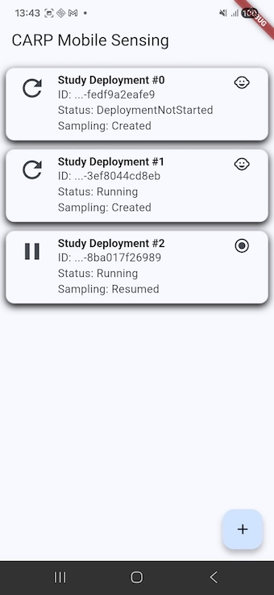
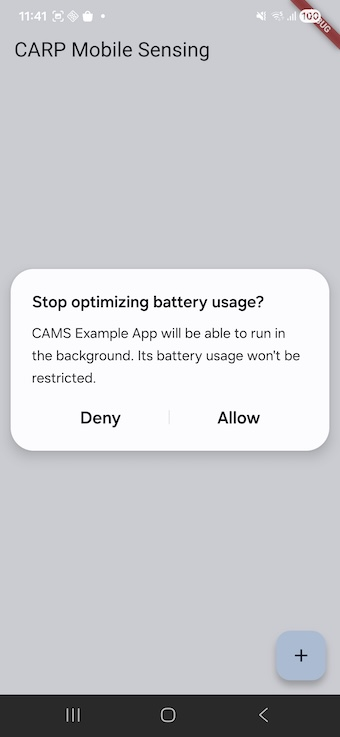

# CARP Mobile Sensing Example App

This app demonstrates how to use the carp_mobile_sensing framework.

## Configuration

The app shows how to set up the `Info.plist` and `AppDelegate.swift` on **iOS** for permissions to access step event and to enable [local_notification](https://pub.dev/packages/flutter_local_notifications) and [flutter_background](https://pub.dev/packages/flutter_background) to work.

Similarly, it shows how to set up the `AndroidManifest.xml` and `build.gradle.kts` files on **Android**. The main issues is to support "[desugaring](https://developer.android.com/studio/write/java8-support)" to be enabled.

## Main Functionality

This demo app is show below. It shows a list of studies in a client manager of CARP Mobile Sensing. Each list tile shows a study showing the study's description and runtime status using a `StreamBuilder` that listens on the `events` stream from the study.

Note that if background sensing is enabled (default) the app will show the "Stop optimizing battery usage" popup. 

You can add a new study using the floating action button (+) at the bottom right corner. This adds a new study based on the `protocol` defined in the app. You can remove a study by long-pressing on the study's list tile.

You can start (i.e., deploy) a study, and resume and pause data sampling by tapping the lef-most icon (refresh/play/pause) of the study's list tile.

__

**Figure 1** – Left: The CAMS Example App showing three studies (added using the "+" button) in three different state. The first study has not yet been "deployed". The second has been deployed and is hence "running". The last study has been "resumed" and is hence sampling data.
Right: The "Stop optimizing battery usage" permission popup. 

